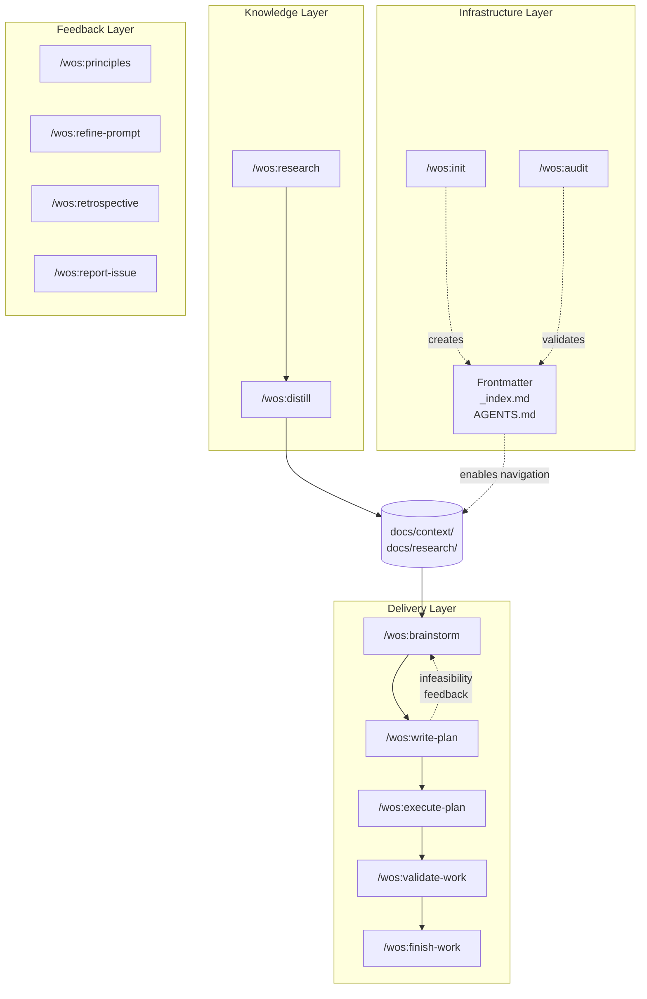

# WOS Overview

WOS is a Claude Code plugin that helps build and maintain structured project
context — turning research into evidence-based context files, and using that
substrate to plan, execute, and deliver work.

## How It Works

### Knowledge Layer

**Research** conducts structured investigations using the SIFT framework (Stop,
Investigate, Find better coverage, Trace claims) and produces verified research
documents with confidence-rated findings. **Distill** converts those research
artifacts into focused context files (200-800 words each) stored in `docs/context/`.
Together they build the evidence-based substrate that planning draws from.

### Delivery Layer

A linear pipeline from idea to merged code:

1. **Brainstorm** — divergent-then-convergent design dialogue; produces an approved design doc
2. **Write Plan** — converts the design into a structured implementation plan with tasks, file changes, and validation criteria; includes an infeasibility check that can loop back to brainstorm
3. **Execute Plan** — implements each task, commits with SHA-tracked checkboxes, supports multi-session resumption
4. **Validate Work** — verifies completed work meets the plan's criteria end-to-end (automated checks + human criteria); plan stays in `executing` until all criteria pass
5. **Finish Work** — presents integration options (merge, PR, keep, discard) after tests pass

### Infrastructure Layer

**Init** creates the discovery infrastructure: directory structure (`docs/context/`,
`docs/research/`, `docs/plans/`, `docs/designs/`), the WOS-managed section in AGENTS.md with
navigation instructions, and auto-generated `_index.md` files. **Audit** validates
that infrastructure stays healthy — checking frontmatter, content quality, URL
reachability, index sync, and skill quality.

The discovery mechanism is what makes context files usable: frontmatter makes each
document self-describing, `_index.md` files make directories browsable, and AGENTS.md
teaches agents how to navigate the project.

### Feedback Layer

Skills that operate independently at any point in the lifecycle:

- **Principles** — captures and maintains project principles in `PRINCIPLES.md`; detects drift over time
- **Refine Prompt** — assesses and improves prompts (including SKILL.md files) using evidence-backed techniques
- **Retrospective** — reviews the current session and submits structured feedback as a GitHub Issue
- **Report Issue** — files bugs, feature requests, and feedback against the WOS repo

## Skills Reference

| Skill | Purpose |
|-------|---------|
| `/wos:init` | Initialize or update WOS project context |
| `/wos:audit` | Validate project health (8 checks + auto-fix) |
| `/wos:research` | SIFT-based research with source verification |
| `/wos:distill` | Convert research artifacts into focused context files |
| `/wos:brainstorm` | Collaborative design dialogue before planning |
| `/wos:write-plan` | Convert approved designs into implementation plans |
| `/wos:execute-plan` | Execute plans with lifecycle enforcement |
| `/wos:validate-work` | Verify completed work meets plan criteria |
| `/wos:finish-work` | Structured work integration (merge/PR/keep/discard) |
| `/wos:principles` | Capture and maintain project principles |
| `/wos:refine-prompt` | Assess and refine prompts using evidence-backed techniques |
| `/wos:retrospective` | Session review and feedback submission |
| `/wos:report-issue` | File GitHub issues against WOS repo |

### Commands

| Command | Purpose |
|---------|---------|
| `/wos:consider` | Mental models for problem analysis (16 models) |
| `/wos:consider:{model}` | Apply a specific mental model (e.g., `first-principles`, `inversion`) |
